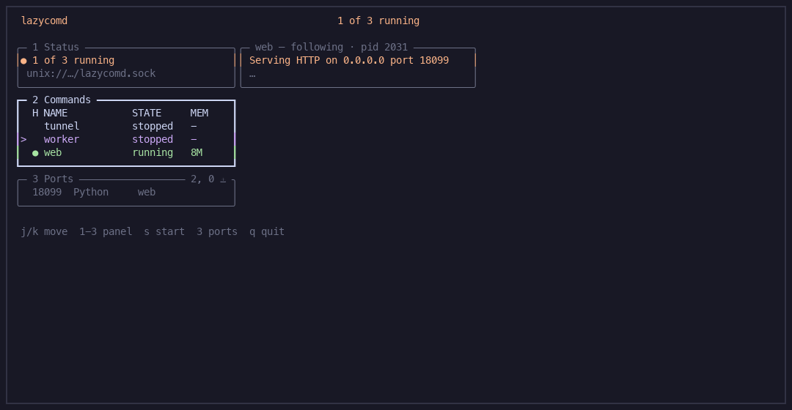

# lazycomd

One daemon for every long-running command. Quit the TUI, nothing dies.
Ports tell you who owns 3000.



Docs: https://thanhphuchuynh.github.io/lazycomd/

## Install

```bash
curl -sSfL https://github.com/thanhphuchuynh/lazycomd/releases/latest/download/install.sh | sh
```

That puts `~/.local/bin/lazycomd`, starts the daemon, and enables it at login.
`lazycomd` with no args opens the TUI. `q` leaves everything running.

## Example

```yaml
# ~/.config/lazycomd/config.yaml
commands:
  tunnel:
    cmd: ["cloudflared", "tunnel", "--url", "localhost:3000"]
    autostart: true
    restart: on-failure
    port: 3000
projects:
  - ~/coding/app
```

```yaml
# ~/coding/app/lazycomd.yaml
commands:
  api:
    cmd: ["go", "run", "."]
    port: 8080
    health: http://localhost:8080/healthz
  web:
    cmd: ["npm", "run", "dev"]
    depends_on: [api]
    port: 3000
```

Then `lazycomd` → `2` → `s` on `app:web`. Or from a shell:

```bash
lazycomd start app:web --wait 30s   # blocks until it answers, non-zero if it never does
lazycomd port 3000                  # who owns the port, and whether it is ours
lazycomd doctor                     # what will fail to start, before it does
lazycomd ls --json                  # every verb has one
```

## For agents

```bash
claude mcp add lazycomd -- lazycomd mcp
```

Your agent's shell dies when its turn ends, so anything it starts dies with
it. `lazycomd mcp` gives it eleven tools over the same daemon you use — start
and wait for readiness, read the crash log, find who holds a port, check the
catalog, register what it just scaffolded — and what it starts is still up on
its next turn, in your TUI.

[Docs: agents](https://thanhphuchuynh.github.io/lazycomd/agents/).

## vs the others

| | lazycomd | mprocs | process-compose | overmind |
|---|---|---|---|---|
| Quit the UI, processes stay | yes | no | only if you ran headless | with `-D` |
| One catalog for every project | yes | per folder | per folder | per Procfile |
| HTTP API | yes | no | yes | no |
| Who owns this port? | yes | no | no | no |
| MCP server for agents | yes | no | no | no |

mprocs dies when you quit. process-compose is docker-compose for binaries.
overmind is tmux + Procfile. lazycomd is the leftover slot: one user-wide daemon.
